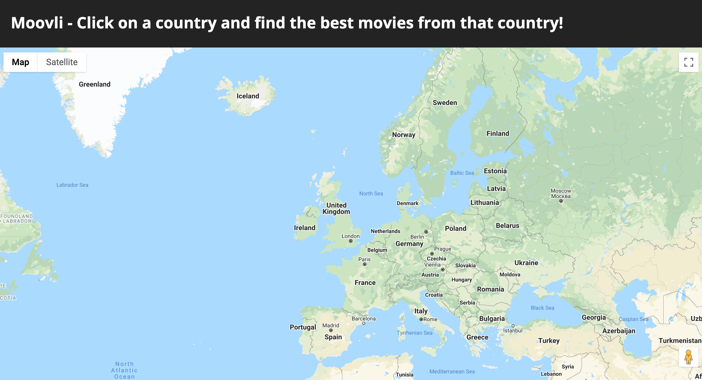
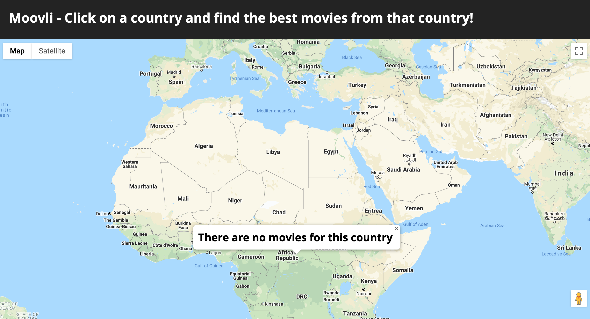
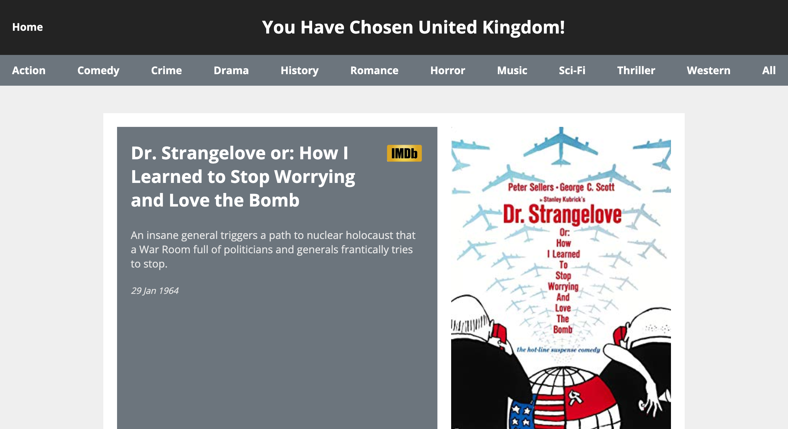
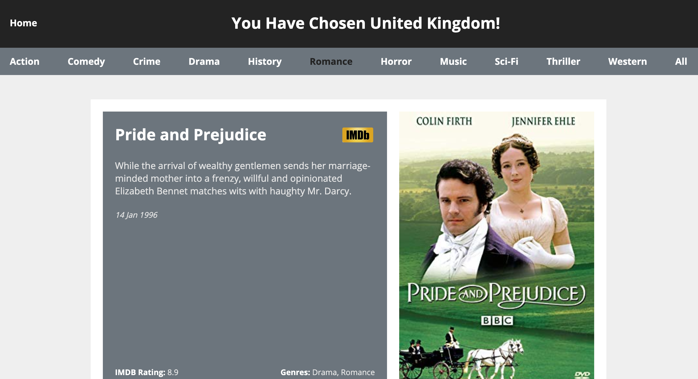

# Moovli

[Makers Academy](https://makers.tech/) Final Project - A React front-end application where you can click on any country and get the best movies for that country.

## Description

Struggling to find a great movie? Are you spending hours scrolling down Netflix as your eyes glaze over and you become increasingly bored?

Introducing Moovli - a movie suggestion app that allows you to find the best movies from across the world. Moovli allows users to interact with a map and click on any country to see some of best movies available.

## Live demo

The application is deployed to Heroku at this link: [https://moovli.herokuapp.com](https://moovli.herokuapp.com/)

## Prerequisites

* Clone this repository with ```git clone git@github.com:AndreaDiotallevi/moovli.git```
* Change into the folder with ```cd moovli```
* Install all the dependencies with ```npm install```
* Open the local server with ```npm start```

## Technologies Used

- Main technologies:
  * [React](https://reactjs.org/): a JavaScript library we used to build the user interface and gather data from external APIs.
  * [Python](https://www.python.org/): a general purpose programming language we used for web scraping.
  * [CSS Flexbox](https://developer.mozilla.org/en-US/docs/Web/CSS/CSS_Flexible_Box_Layout/Basic_Concepts_of_Flexbox): the flexible box layout module makes it easier to design flexible responsive layout structure without using float or positioning.
  
- External APIs:
  * [Google Maps Api](https://developers.google.com/maps/documentation): web service we used to show the map on the page and get geographical coordinates from the user click.
  * [LocationIQ API](https://locationiq.com/docs): web service we used to get the country information from geographical coordinates.
  * [OMDb API](http://www.omdbapi.com/): web service we used to get each movie information by title.
  
  
- Testing frameworks:
  * [Jest](https://jestjs.io/): a JavaScript Testing Framework with a focus on simplicity.
  * [Enzyme](https://www.npmjs.com/package/enzyme): a JavaScript Testing utility for React that makes it easier to test the React Components' output.

## How to Run the Tests

To run all the tests type ```npm test```

## Design Approach

The application has four react components and each of them has a clear responsibility:

  - ```App```: application main container.
  
  - ```Home```: responsible for showing the homepage title and containing the MapContainer component.
  
  - ```MapContainer```: responsible for showing the map and managing the info window.
  
  - ```Movies```: responsible for listing the best movies for each country and filtering them by genre.

## Code Quality

* [ESLint](https://eslint.org/): tool for identifying and reporting on patterns found in ECMAScript/JavaScript code, with the goal of making code more consistent and avoiding bugs.

## Continuous Integration

* [CircleCI](https://circleci.com/): tool for automating the development process quickly, safely, and at scale.

## User Stories

```
As a user,
So that I can see all countries,
I'd like to see a map of the World

As a user,
So that I can choose a country,
I'd like to be able to be able to click on a country

As a user,
So that I can see some great movie suggestions,
I'd like to see a list of movies for the country I selected,

As a user,
So that I can recognize each movie,
I'd like to see the title of each movie.

As a user,
So that I can know what a movie is about,
I'd like to see a description of each movie.

As a user,
So that I can know the level of a movie,
I'd like to see the ratings for each movie.

As a user,
So that I can know how old is a movie,
I'd like to see the release date for each movie

As a user,
So that I can return to the home page,
I'd like to be able to use a back button on the movies page.

As a user,
So that I can pick my favorite type of movie,
I'd like to be able to filter the available movies by genre.

As a user,
So that I can read reviews and learn more about a movie,
I would like to see a link to the IMDB page for each movie.

```

## Live Features

* If you go to the Moovli homepage [https://moovli.herokuapp.com](https://moovli.herokuapp.com/) you will see a map of the world:



* If you click on a country that doesn't have any available movie, the info window shows a useful message to the user:



* If you click on a country that has available movies, you are redirected to the movies page, with the best movies from that country:



* If you click on one of the genre buttons, you can filter the movies by genre:



* If you click on the IMDB link, you are redirected to the IMDB web page of the selected movie:


